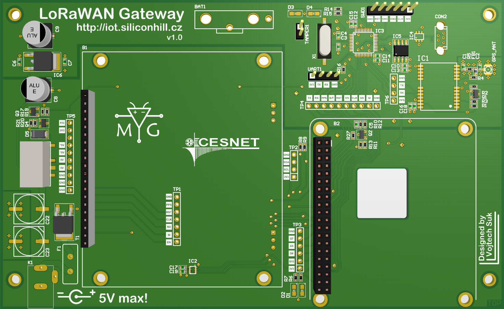

# LoRaWAN Gateway - backplane

## Base components
 - Raspberry Pi 3 Model B (small single-board ARMv8 computer)
 - iC880A (RF frontend for LoRa technology)
 - STM32F103 (CortexM3 MCU)
 - u-blox NEO 6 (GPS frontend with PPS output)

## Function(s)
 1. LoRaWAN concetrator with packet time-mark support.
    - TheThingNetwork community gateway
    - Own implementation or alternative opensource backends
 2. NTP stratum 0
    - PPS signal from GPS can be used as reference signal for NTP server
 3. DGPS base station
    - RAW data can be used for precise navigation of many things (robots, cars, ...)
 4. Long time performance and stability testing for SDcard based computers
    - Primary purpose of STM32 MCU is watchdog and log records management for RPi
    - There is a 8Mbit FLASH for store stdout output on serial line
    - BMP280 can measure temperature and presure with great accuracy for long time

## Documentation
[PDF with schematic](LoRaGW-backplane.PDF)

### 3D model screenshot:

